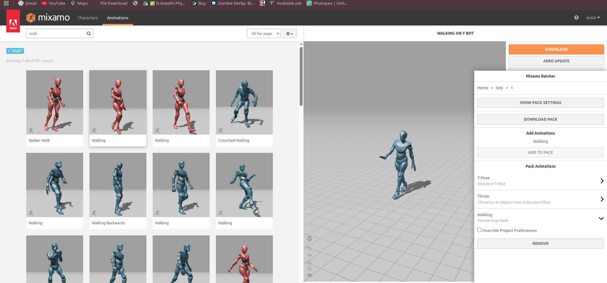

# Mixamo Batcher 2.0

> A modern Manifest V3 Chrome extension for organizing, customizing, and batch-exporting Mixamo animations.

[](https://developer.chrome.com/docs/extensions/develop/migrate/what-is-mv3)
[](https://www.mixamo.com/)
[](LICENSE)

Mixamo Batcher 2.0 brings project management, animation packs, per-animation preferences, in-place export controls, and ZIP batch downloads directly into the Mixamo animation workflow. It is designed for creators who need to prepare a character’s complete animation set without repeatedly configuring and downloading each FBX file by hand.

This is a **community-maintained modernization** of the original open-source [Mixamo Batcher by Faris Mustafa][1]. The original author and project are credited below.



## Why Mixamo Batcher 2.0?

The standard Mixamo interface is excellent for previewing and downloading individual animations, but it is not optimized for building reusable animation libraries. Mixamo Batcher adds a persistent workspace beside Mixamo so you can group animations by character and project, preserve settings, and export a complete pack as one archive.

| Capability | What it provides |
| --- | --- |
| Projects | Organize multiple characters and animation packs. |
| Animation packs | Save a reusable collection of animations for a specific character. |
| Batch download | Export a complete pack as a ZIP archive instead of downloading files one by one. |
| In-place export | Apply **In Place** to an entire pack or override it for individual animations. |
| Download preferences | Choose FBX or Collada, skin settings, frame rate, and keyframe reduction. |
| Saved Mixamo parameters | Preserve supported animation settings such as trim, arm space, and motion parameters. |
| Import and export | Back up projects as JSON and restore them later. |
| Modern browser support | Manifest V3, CSP-safe injection, and guarded XHR/fetch interception. |

## Installation

Mixamo Batcher 2.0 is currently distributed as an unpacked Chrome extension because the original Web Store listing is no longer available.

For browser-specific instructions and troubleshooting, see the full [manual installation guide](INSTALLATION.md).

1. Download the latest `mixamo-batcher-2.0.1.zip` from the [Releases](https://github.com/unkitpi/mixamo-batcher-2.0/releases) page.
2. Extract the ZIP archive to a permanent folder.
3. Open `chrome://extensions` in Chrome or Chromium.
4. Enable **Developer mode**.
5. Choose **Load unpacked** and select the extracted extension folder.
6. Open [Mixamo][2], sign in, and reload the page.
7. Open the **Animations** view. The Batcher panel appears in the right-side workspace.

The extension requires an authenticated Mixamo session for animation and character operations. It does not collect project data on a remote server; projects are stored locally in the browser.

## Quick start

Create a project, create a pack while the desired character is displayed, then search Mixamo for an animation. Select the animation in Mixamo and choose **Add To Pack** in the Batcher panel. Repeat this for the animations you need and choose **Download Pack**.

To export every animation with root translation removed, open **Pack Settings** and enable **In Place for Entire Pack**. To customize one animation differently, expand that animation, enable **Override Project Preferences**, and change its individual download settings.

Before uninstalling the extension or clearing extension data, use the project export function to create a JSON backup.

## Compatibility improvements in 2.0

Mixamo Batcher 2.0 updates the original extension for current Chromium and Mixamo behavior.

- Migrated from Manifest V2 to Manifest V3.
- Replaced the background page with a service worker.
- Added CSP-safe `postMessage` communication instead of inline script injection.
- Added guarded interception for both `XMLHttpRequest` and `fetch` API traffic.
- Improved SPA navigation handling and right-sidebar docking.
- Fixed project-wide **In Place** settings so they are included in batch export requests.
- Added an explicit entire-pack placement control.
- Removed the obsolete analytics injection from the extension UI.
- Added a repeatable headless Chromium smoke test.

## Development

```bash
git clone https://github.com/unkitpi/mixamo-batcher.git
cd mixamo-batcher
pnpm install --ignore-scripts
pnpm build
```

The production extension is generated in `dist/`. The packaged archive is `dist/mixamo-batcher-2.0.1.zip`.

Run the extension smoke test with:

```bash
./smoke-test.sh
```

The test loads the unpacked extension in headless Chromium and verifies that the Batcher iframe mounts on the current Mixamo animations route.

## Known limitations

Mixamo Batcher depends on Mixamo’s authenticated web application and private API response structures. A future Mixamo application change may require another compatibility update. Download speed, export availability, authentication, rate limits, and archive limits remain controlled by Mixamo and the browser.

The extension is not affiliated with, sponsored by, or endorsed by Adobe or Mixamo.

## Attribution and license

This project is a community fork and modernization of [farism/mixamo-batcher][1], originally created by **Faris Mustafa**. The original project description, concepts, UI structure, and MIT license are acknowledged and retained as applicable. The original README is preserved as `README-original.md` for historical reference.

Mixamo Batcher 2.0 is released under the [MIT License](LICENSE).

[1]: https://github.com/farism/mixamo-batcher "Original Mixamo Batcher by Faris Mustafa"
[2]: https://www.mixamo.com/ "Adobe Mixamo"
[3]: https://developer.chrome.com/docs/extensions/develop/migrate/what-is-mv3 "Chrome Extensions Manifest V3"
